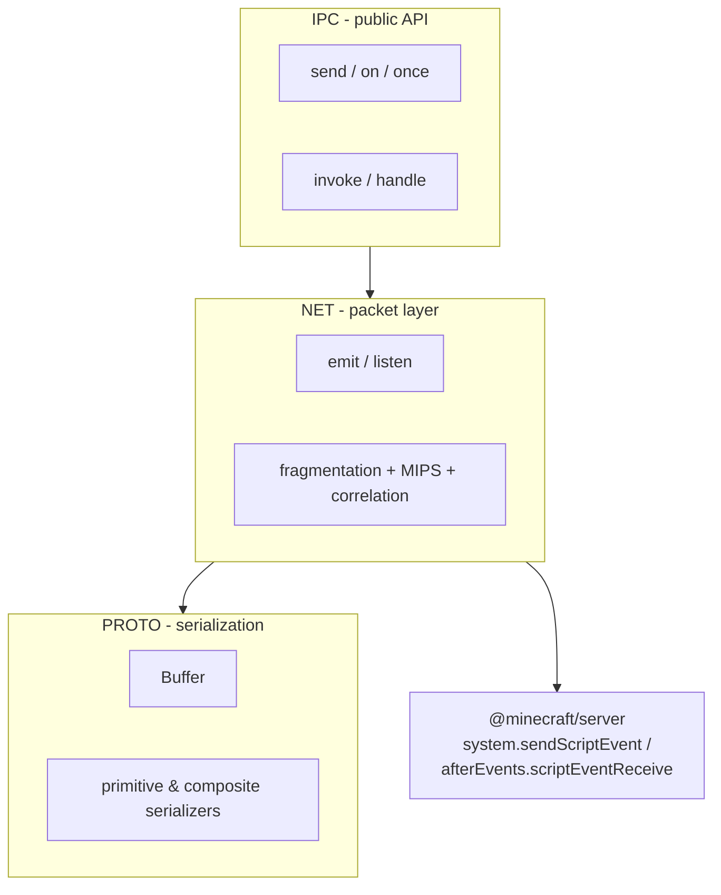

# MCBE-IPC Documentation

MCBE-IPC ("**I**nter-**P**ack **C**ommunication") is a library that lets separate Minecraft
Bedrock Script API contexts - typically different behavior packs in the same world - exchange
structured, typed data with each other. Minecraft only gives packs one narrow bridge for this:
the `scriptevent` system, which moves a pair of short strings (`id`, `message`) between packs and
nothing else. MCBE-IPC turns that primitive into:

- a **binary serialization framework** for describing arbitrary data shapes,
- a **packet layer** that frames, fragments, and reassembles that binary data across the
  `scriptevent` string limits, and
- a **small, ergonomic API** (`send`/`on`/`once`/`invoke`/`handle`) that looks like `EventTarget`
  or Node's `EventEmitter`/IPC, hiding all of the above.

The entire implementation lives in a single file, [`src/ipc.ts`](../src/ipc.ts), organized into
three nested namespaces that mirror the layers above:



## Where to start

| Page | Read this if you want to... |
|---|---|
| [Getting Started](./getting-started.md) | Install the library and send your first message in five minutes |
| [Architecture](./architecture.md) | Understand how the three layers fit together and why they exist |
| [IPC API Reference](./ipc-api.md) | Look up `send`, `on`, `once`, `invoke`, or `handle` in detail |
| [Serialization (PROTO)](./serialization.md) | Learn the `Serializable<T>` model and every built-in serializer |
| [Advanced Serializers](./advanced-serializers.md) | `Union`, `Any`, `Transform`, `Cached`, `Lazy`/`Recursive`, `Checked` |
| [Wire Protocol (NET)](./wire-protocol.md) | Understand exactly what bytes cross the `scriptevent` boundary, for debugging or porting |
| [FAQ & Troubleshooting](./faq-troubleshooting.md) | Diagnose common problems |
| [Development](./development.md) | Build, test, benchmark, or contribute to the library itself |
| [Glossary](./glossary.md) | Look up a term you've seen elsewhere in these docs |

## At a glance

```ts
import IPC, { PROTO } from 'mcbe-ipc';

// fire-and-forget, one-to-many
IPC.on('greet', PROTO.String, name => console.log(`Hello, ${name}!`));
IPC.send('greet', PROTO.String, 'World');

// request/response, one-to-one
IPC.handle('double', PROTO.Float64, PROTO.Float64, n => n * 2);
const result = await IPC.invoke('double', PROTO.Float64, 21, PROTO.Float64); // 42
```

## Compatibility

| Package | Version |
|---|---|
| `@minecraft/server` | `^1.18.0` |

MCBE-IPC ships as ESM (`"type": "module"`), with bundled TypeScript declarations. It can be
installed via `npm install mcbe-ipc`, or copied directly into a project as `ipc.js`/`ipc.d.ts`
(compiled) or `ipc.ts` (source) - see [Getting Started](./getting-started.md).

## Protocol specification

The wire format this library implements is formally documented as its own RFC:
[MCBE-IPC Packet Standard (MIPS)](https://gist.github.com/OmniacDev/ecd6f61ffd8d0ed6be1b7cf6ecea9145).
[Wire Protocol](./wire-protocol.md) walks through how `src/ipc.ts` implements it.
