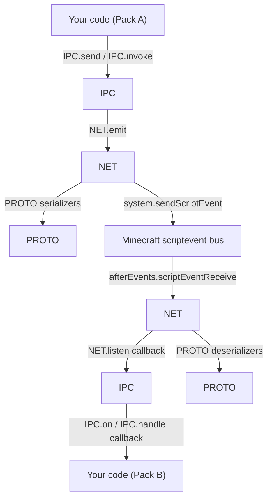
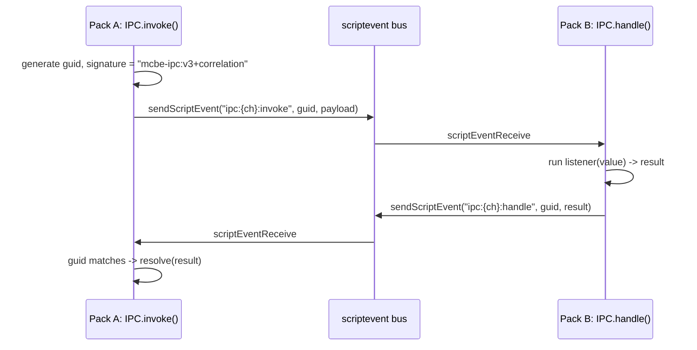

# Architecture

MCBE-IPC is organized as three nested TypeScript namespaces in
[`src/ipc.ts`](../src/ipc.ts), each building on the one below it:

| Namespace | Responsibility |
|---|---|
| `PROTO` | Binary serialization: turn typed values into bytes and back |
| `NET` | Packet framing, fragmentation, and transport over `scriptevent` |
| `IPC` | User-facing channel API: `send`, `on`, `once`, `invoke`, `handle` |

A small internal `UTIL` namespace provides `generate_id()`, an 8-hex-character random ID used for
packet GUIDs.

## Why this shape?

Minecraft's `scriptevent` API is deliberately minimal - one pack calls
`system.sendScriptEvent(id: string, message: string)`, and another subscribes to
`system.afterEvents.scriptEventReceive` to receive `{ id, message, sourceType }`. That comes with
a handful of hard constraints:

- Both `id` and `message` are plain strings with restrictive maximum lengths - there's no way to
  send an arbitrary object, or a large payload, in one call.
- Only strings are supported, so anything structured has to be encoded and decoded by hand.
- Events are fire-and-forget - there's no built-in way to "ask" another pack for something and
  get a reply back.
- Minecraft's script engine watches how long a script runs synchronously within a single tick;
  encoding or decoding a large payload all at once risks tripping that watchdog. Work like this
  needs to happen incrementally, spread across ticks via `system.runJob`.

Every other capability in this library exists to paper over these:

- **`PROTO`** gives you a type-safe way to describe arbitrary structured data (numbers, strings,
  objects, arrays, maps, unions, recursive types...) and turn it into a compact byte `Buffer`,
  using [generator-based serializers](./serialization.md#why-serializedeserialize-are-generators)
  so that work can be paused and resumed across ticks.
- **`NET`** takes that byte buffer and:
  - encodes it into `scriptevent`-safe strings ([MIPS](./wire-protocol.md#mips-encoding) for the
    `id` field, a denser packing for the `message` field),
  - splits it into multiple `scriptevent` calls if it's too large to fit in one message
    ([fragmentation](./wire-protocol.md#fragmentation)),
  - reassembles fragments back into a single buffer on the receiving end,
  - and adds a correlation `guid` so responses can be matched back to requests.
- **`IPC`** hides all of that behind five functions with familiar names and semantics
  (`send`/`on`/`once` for pub-sub, `invoke`/`handle` for RPC).

## Channel namespacing

`IPC` doesn't invent a new transport - it just calls `NET.emit`/`NET.listen` with conventionally
prefixed endpoint names:

| `IPC` call | Underlying `NET` endpoint |
|---|---|
| `IPC.send(channel, ...)` / `IPC.on(channel, ...)` / `IPC.once(channel, ...)` | `ipc:{channel}:send` |
| `IPC.invoke(channel, ...)` (request) | `ipc:{channel}:invoke` |
| `IPC.invoke(channel, ...)` (response) / `IPC.handle(channel, ...)` | `ipc:{channel}:handle` |

Because these are just string endpoint names, you can drop down to `NET.emit`/`NET.listen`
directly if you need a pattern `IPC` doesn't provide - this is exactly how the library's own
tests verify cross-version compatibility (an old raw `NET.listen`-based responder can serve a new
`IPC.invoke` caller, and vice versa; see the "backwards-compat" tests in `tests/ipc.test.ts`).

## Request lifecycle (`invoke` -> `handle`)

See [Wire Protocol](./wire-protocol.md) for the exact byte-level framing behind each arrow, and
[Correlation](./wire-protocol.md#correlation) for how concurrent `invoke` calls stay
disambiguated.

## Next

- [IPC API Reference](./ipc-api.md)
- [Serialization](./serialization.md)
- [Wire Protocol](./wire-protocol.md)
- [Glossary](./glossary.md) - quick lookup for any unfamiliar term
